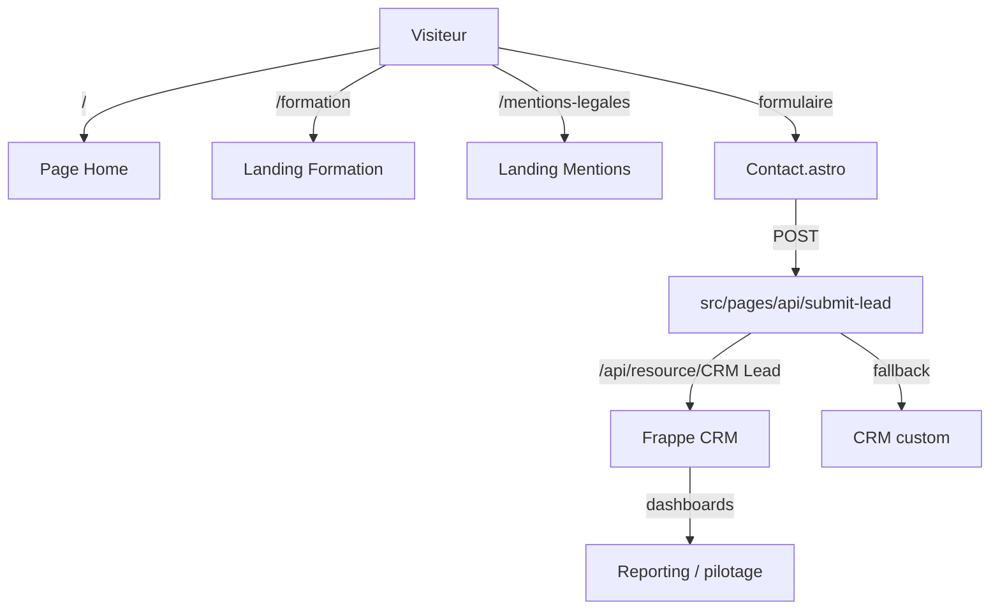
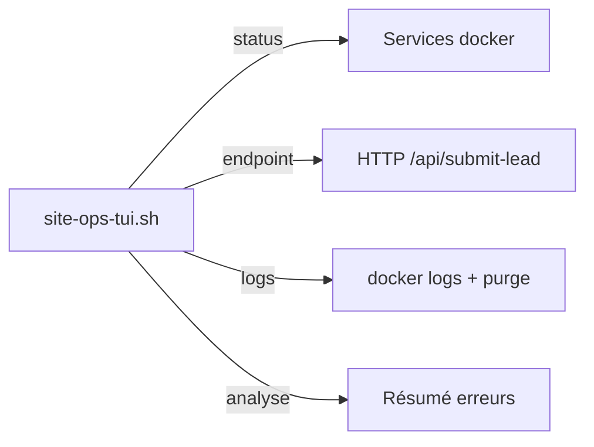

# Feature Map Ecosysteme - Electron Rare Site SSR

Date: 2026-03-19
Source de verite: `docs/README.md` + `src/*`

## Portée active

- Home conversion: hero, approche, preuves, missions, FAQ.
- Parcours lead: formulaire de contact + fallback mail.
- Exploitation: logs TUI, vérifications endpoint, déploiement via container.

## Carte des fonctionnalités

| Bloc | Objectif | Fichiers | Etat |
|---|---|---|---|
| Contact form direct | Générer un lead qualifié | `src/components/sections/Contact.astro`, `src/pages/api/submit-lead.ts` | Actif |
| Routing public | Pages et health en prod | `src/pages/index.astro`, `src/pages/formation.astro`, `src/pages/404.astro`, `src/pages/mentions-legales.astro` | Actif |
| Observabilité opérationnelle | Supervision du site en production | `scripts/site-ops-tui.sh` | Actif |
| Ops & déploiement | Build SSR + Docker + Traefik | `Dockerfile`, `infra/docker-compose.site.yml` | Actif |
| SEO / publication | Canonicals + sitemaps + robots | `src/lib/site.ts`, `scripts/build-astro-external.mjs`, `src/pages/sitemap.xml.ts` | Actif |

## Mermaid - Surface active

## Mermaid - Contrôle opérationnel

